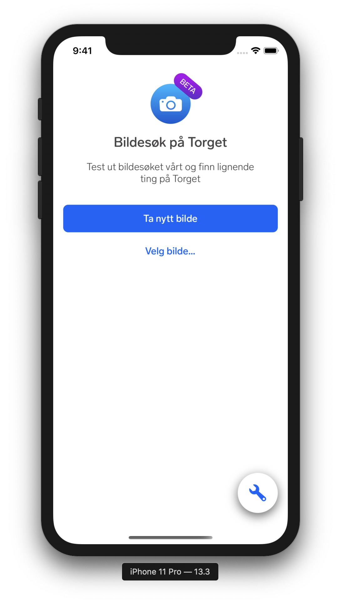
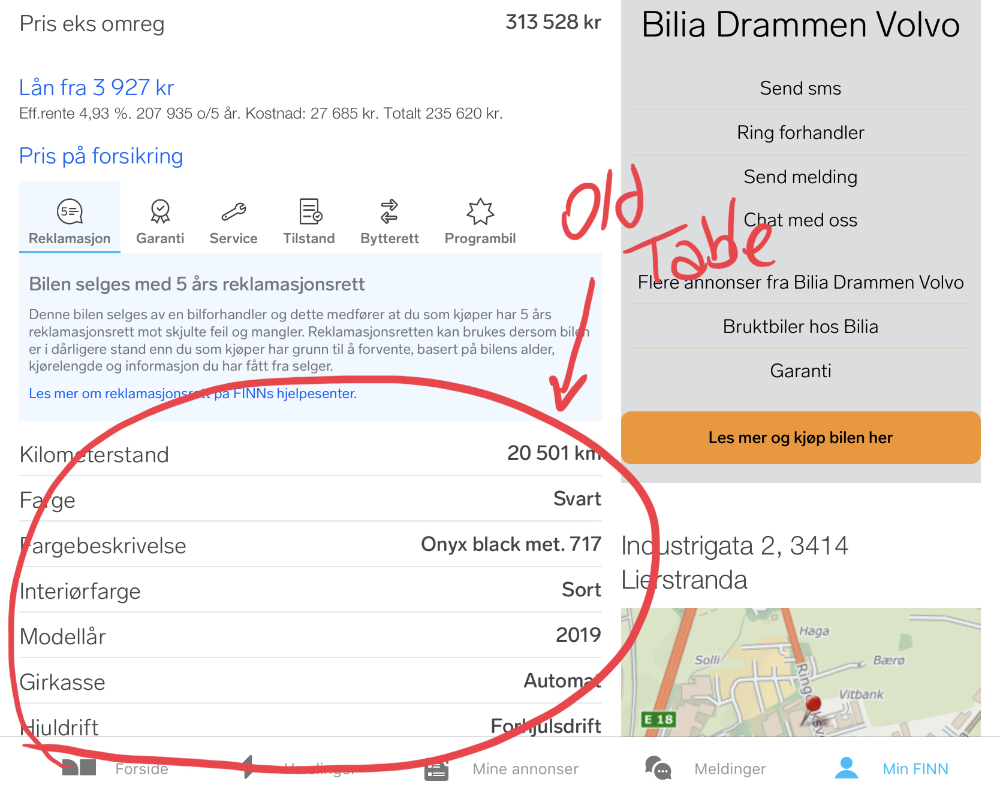
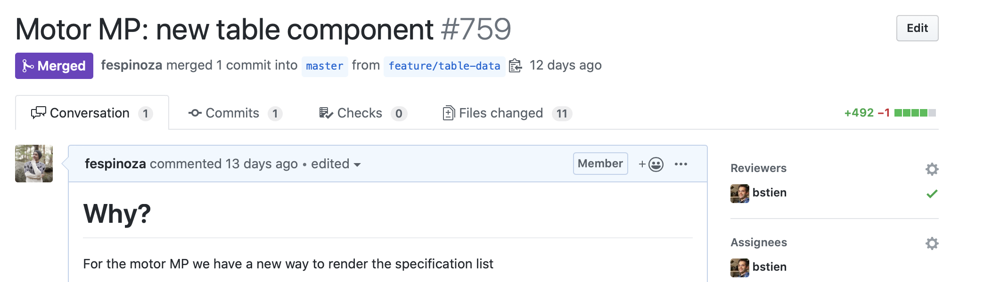
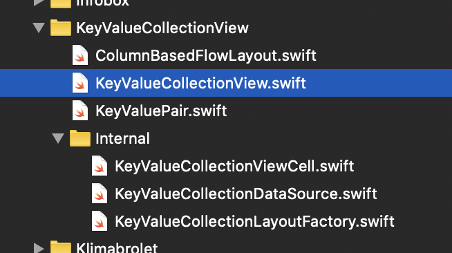
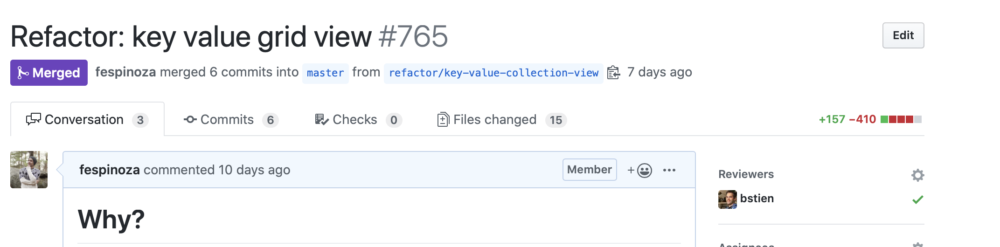
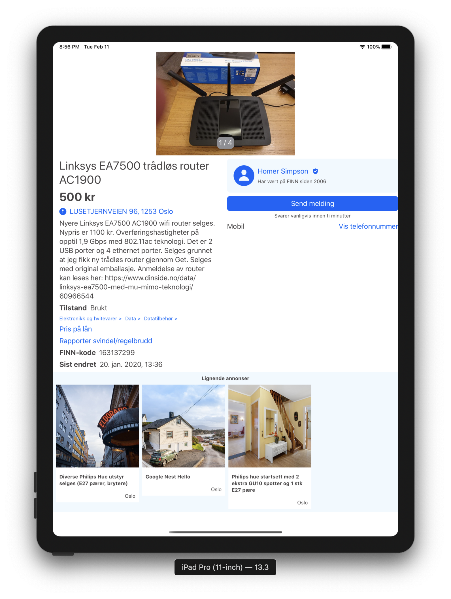
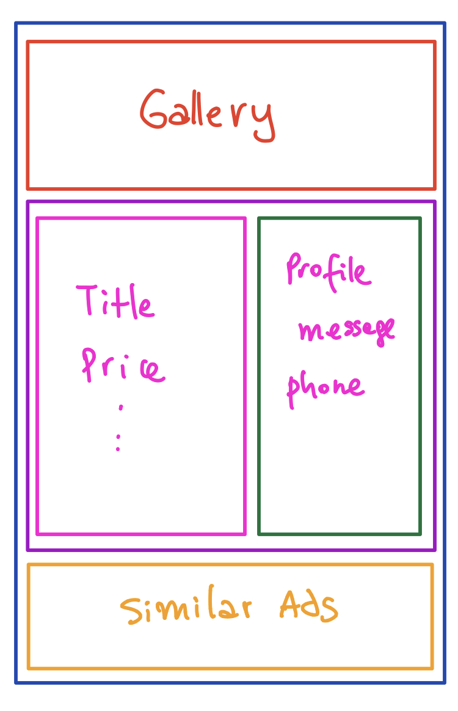

theme: next, 4

# Views: complexity and reusability
## Experiments comparing SwiftUI and UIKit

---

## `$ whomami`

- Felipe Espinoza
- iOS Dev @ FINN.no
- [@fespinoza on github](https://github.com/fespinoza)
- [@fespinozacast on twitter](https://twitter.com/fespinozacast)


^ This are just thoughts based on experiences I wanted to share, no absolute truths

---

## What do I mean by complexity?

---

### Creating views in `UIKit`

- initialize
- position / size[^1]
- styling
- passing data
- update to changes

[^1]: size may depend on content

^ this is just about views/layouts, don't get me started with view controllers

---

```swift
class SampleViewController: UIViewController {
    override func viewDidLoad() {
        super.viewDidLoad()
        view.backgroundColor = .red
        
        let label = UILabel()
        label.translatesAutoresizingMaskIntoConstraints = false
        label.text = "Hello"
        
        let button = UIButton()
        button.setTitle("Hello Who?", for: .normal)
        button.translatesAutoresizingMaskIntoConstraints = false
        button.addTarget(self, action: #selector(tap), for: .touchUpInside)
        
        self.view.addSubview(label)
        self.view.addSubview(button)
        
        NSLayoutConstraint.activate([
            label.topAnchor.constraint(equalTo: self.view.topAnchor, constant: 30),
            label.centerXAnchor.constraint(equalTo: self.view.centerXAnchor),
            
            button.topAnchor.constraint(equalTo: label.bottomAnchor, constant: 30),
            button.centerXAnchor.constraint(equalTo: self.view.centerXAnchor),
        ])
    }
}
```

---

### FinniversKit

- FINN's UI component library
- it's open source and it's awesome :D
- [FinniversKit on Github](https://github.com/finn-no/FinniversKit)

---




^ similar components produce a bunch of boiler plate
^ https://github.com/finn-no/FinniversKit/blob/ea589b6d3c849916e3ae2febdb880c48155d78ef/Sources/Fullscreen/BetaFeatureView/BetaFeatureView.swift
^ https://github.com/finn-no/FinniversKit/blob/ea589b6d3c849916e3ae2febdb880c48155d78ef/Sources/Fullscreen/SettingDetailsView/SettingDetailsView.swift

---

| BetaFeatureView | SettingDetailView |
| --- | --- |
| BetaFeatureViewModel | SettingDetailViewModel |
| BetaFeatureViewDelegate | SettingDetailViewDelegate |

- similar layout
    - they differ in data requirements and order of elements
- delegates to bubble up touches on buttons
- tons of similar non-shareable boilerplate

^ tons of non reusable boilerplate
^ ad-hoc view models

---

## Case 1: Object page & `KeyValueGridView`

---

### The object page


---

### Example: Object page & `KeyValueGridView`



---

### Example: Object page & `KeyValueGridView`

 

^ original https://github.com/finn-no/FinniversKit/pull/759
^ refactor https://github.com/finn-no/FinniversKit/pull/765

---

### `UICollectionView`

---

### Understanding `UICollectionViewLayout`

To achieve the desired layout:

- Do i use flow layout?
- Do i subclass it? or the normal view layout?
- Do i use the delegate methods?

I need to make the cells's height to adjust to the content


---

### Understanding `UICollectionViewLayout`

```swift
 override func prepare() {
  super.prepare()
  
  itemAttributes = [UICollectionViewLayoutAttributes]()
  
  guard let collectionView = collectionView else {
      return
  }
  
  let columnsRange = 0 ..< configuration.numberOfColumns
  
  var columns = columnsRange.map { _ in 0 }
  var attributesCollection = [UICollectionViewLayoutAttributes]()
  var yOffset = configuration.topOffset
  
  if let height = delegate.adsGridViewLayout(self, heightForHeaderViewInCollectionView: collectionView) {
      let attributes = UICollectionViewLayoutAttributes(forSupplementaryViewOfKind: UICollectionView.elementKindSectionHeader, with: IndexPath(item: 0, section: 0))
      attributes.frame = CGRect(x: 0, y: 0, width: collectionView.frame.size.width, height: height)
      attributesCollection.append(attributes)
  
      yOffset += height
  }
  
  for index in 0 ..< numberOfItems {
      let columnIndex = indexOfLowestValue(in: columns)
  
      let xOffset = xOffsetForItemInColumn(itemWidth: itemWidth, columnIndex: columnIndex)
      let topPadding = configuration.numberOfColumns > index ? yOffset : 0.0
      let verticalOffset = CGFloat(columns[columnIndex]) + topPadding
  
      let indexPath = IndexPath(item: index, section: 0)
      let itemHeight = delegate.adsGridViewLayout(self, heightForItemWithWidth: itemWidth, at: indexPath)
  
      columns[columnIndex] = Int(verticalOffset + itemHeight + configuration.columnSpacing)
  
      let attributes = UICollectionViewLayoutAttributes(forCellWith: indexPath)
      attributes.frame = CGRect(x: xOffset, y: verticalOffset, width: itemWidth, height: itemHeight)
      attributesCollection.append(attributes)
  }
  
  itemAttributes.append(contentsOf: attributesCollection)
}
```

^ https://github.com/finn-no/FinniversKit/blob/master/Sources/Recycling/GridViews/Ads/GridView/AdsGridViewLayout.swift#L78-L119
^ 40 lines

---


---

### It shows clearly the "**_How_**", not the "**_What_**"

---

### First attempt: `UICollectionView`

 
 

---

### But then...

- The object page was a collection view
- The cells need to calculate their height for the given width
- My new component is supposed to be inside one of this cells
- The height of the new table component was calculated asynchronously
 
---

### Challenges when using `UICollectionView`

- self-sizing content
- asynchronous calculation of height

$$
  collectionView(collectionView) = complexity^2
$$

---

### Challenges when using `UICollectionView`

- it's hacking time!

 

---

### Or...

---

### Second Attempt: `UIStackView`




---

### Second Attempt: `UIStackView`

- The height of the component itself will be available synchronously when passing the data.
- The integration to the object page doesn't require any hacks and it's easier.

---

### When not to use `UICollectionView`

- No cell reuse
- No dynamic data

---

## Case 2: `SwiftUI`

---


^ there are multiple markets the finn app has to support
^ the object page, being a collection view was super difficult to understand...one view controller to rule them all

---


^ then i try to solve in swift UI just one case in particular... the Torget ads

---

```swift
import SwiftUI

struct AdView: View {
    let adViewModel: AdViewModel
    let imageDownloader: CollectionImageDownloader

    var body: some View {
        ScrollView {
            VStack(alignment: .leading, spacing: .spacingM) {
                imageGalleryView

                Group {
                    titleView
                    priceView
                    sendMessageButton
                    phoneNumber
                    profileView
                    addressView
                    descriptionView
                    conditionView
                }.padding(.horizontal)

                similarAdsView
            }
        }
    }
}
```


---

```swift
extension AdView {
    var titleView: some View {
        Text(adViewModel.title).title()
    }

    var priceView: some View {
        Text(adViewModel.price).titleStrong()
    }

    var sendMessageButton: some View {
        VStack(alignment: .center, spacing: .spacingS) {
            FINCTAButton {
                Text("Send melding")
            }
            Text(adViewModel.onwerAverageResponseTime).caption()
        }
    }

    var imageGalleryView: some View {
        GalleryView(imageDownloader: imageDownloader)
    }
}
``` 


---



^ the ipad has a different distribution of elements

---

### Conditional Layout

[.code-highlight: none]
[.code-highlight: 7, 11-15]
[.code-highlight: all]

```swift
struct AdView: View {
    let adViewModel: AdViewModel
    var imageDownloader: CollectionImageDownloader {
        CollectionImageDownloader(adViewModel: adViewModel)
    }

    @Environment(\EnvironmentValues.horizontalSizeClass) var horizontalSizeClass

    var body: some View {
        ScrollView {
            if horizontalSizeClass == UserInterfaceSizeClass.compact {
                compactLayout
            } else {
                regularLayout
            }
        }
    }
}
```

---

### Conditional Layout

```swift
extension AdView {
    var compactLayout: some View {
        VStack(alignment: .leading, spacing: .spacingM) {
            imageGalleryView

            Group {
                titleView
                priceView
                sendMessageButton
                phoneNumber
                // same as before..
            }.padding(.horizontal)

            similarAdsView
        }
    }
}
```

---

### Conditional Layout

```swift
extension AdView {
    var regularLayout: some View {
        VStack(alignment: .leading, spacing: .spacingM) {
            imageGalleryView

            HStack(alignment: .top, spacing: .spacingM) {
                VStack(alignment: .leading, spacing: .spacingM) {
                    Group {
                        titleView
                        priceView
                        addressView
                        descriptionView
                        // ...
                    }.padding(.horizontal)
                }

                VStack(alignment: .leading, spacing: .spacingM) {
                    profileView
                    sendMessageButton
                    phoneNumber
                }
            }

            similarAdsView
        }
    }
}
```



---

## Recap

---

### Recap (or just stating the obvious)

- use the right tool for the job (_I'm looking at you `UICollectionView`_)
- SwiftUI declarative syntax makes creating small/reusable components way better than UIKit
- multiple simple components, over single "universal" component
- ☝️ together with top level decisions, make implementing different layouts/scenarios easy.

^ in this kind of problems, swiftUI shines to render non collection-like content
^ SwiftUI layout system is waaay simpler than auto layout

---

# Views: complexity and reusability
## Experiments comparing SwiftUI and UIKit

---

## Bonus

---

### Bonus

- Attemp to use iOS 13 UICollectionView features while supporting iOS 11+: https://github.com/finn-no/FinniversKit/pull/759

^ I think projects should start using SwiftUI for non-critical features first or having 2 versions of views (maybe?)